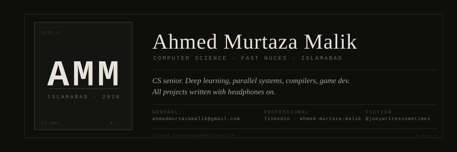

<div align="center">
  
</div>

<br/>

## Projects

| # | Title | feat. |
|---|-------|-------|
| 01 | [Suraiyya](https://github.com/ahmedmurtazamalik) | MERN · WebRTC · PyTorch · sentiment analysis · gamified task management |
| 02 | [Multimodal RAG System](https://github.com/ahmedmurtazamalik/multimodal-rag-system) | Python · CLIP · FAISS · text + image retrieval |
| 03 | [Scholar Sense](https://github.com/ahmedmurtazamalik) | RAG · LLMs · automated systematic literature reviews |
| 04 | [GAN vs Diffusion](https://github.com/ahmedmurtazamalik/facial-attribute-editing-gan-diffusion) | PyTorch · CUDA · consumer-GPU inference optimization |
| 05 | [CycleGAN Face-to-Sketch](https://github.com/ahmedmurtazamalik/cyclegan-face-sketch) | PyTorch · unpaired image-to-image translation |
| 06 | [Urdu Seq2Seq Transformer](https://github.com/ahmedmurtazamalik/waste-detection-urdu-poetry-seq2seq) | PyTorch · NLP · Urdu poetry generation + translation |
| 07 | [Butterfly Parallelization](https://github.com/ahmedmurtazamalik/butterfly-parallelization) | MPI · OpenMP · METIS · distributed graph algorithms |
| 08 | [Zeta Compiler](https://github.com/ahmedmurtazamalik/zeta-compiler) | C++ · Java · Flex · Bison · custom language + interpreter |
| 09 | [IPFS-C++](https://github.com/ahmedmurtazamalik/IPFS-cpp) | C++ · Ring DHT · distributed hash tables |
| 10 | [Pacman in x86](https://github.com/ahmedmurtazamalik/pacman-x86assembly) | Assembly · stubbornness |

---

## Instruments

```
Languages      C++ · C · Python · Java · C# · Rust · SQL · Assembly
AI & ML        PyTorch · TensorFlow · Transformers · Hugging Face · GANs · Diffusion Models
Parallel       CUDA · OpenCL · MPI · OpenMP · SIMD · OpenACC
Tools          Docker · Kubernetes · MLflow · DVC · Git · Linux (Kali)
```

---

## Experience

**AI Intern · Automotive Artificial Intelligence GmbH** *(Jun – Jul 2025)*
Geospatial data pipelines for HD lane-level mapping in autonomous vehicle navigation.

---

## Liner Notes

President of the FAST Literary Society two years running — General Secretary first, then President. Also headed the Society of Arts. Organized NaSCon three years straight. TA'd and demonstrator'd for three semesters each, which are verbs now. Writes fiction under [@joeywritessometimes](https://www.instagram.com/joeywritessometimes). Runs on noodles and Sting energy drinks. Dean's List three times, which surprised no one more than me.
